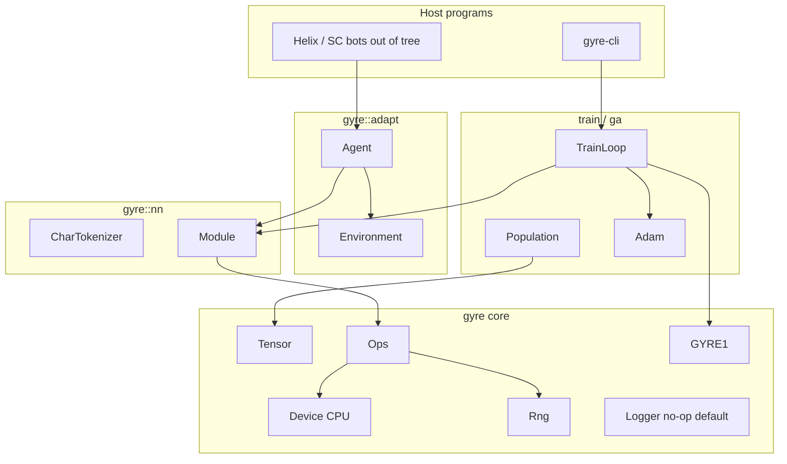

# Gyre: C++23 Neural & Genetic Compute Library

| Field | Value |
| --- | --- |
| **Author** | Project owner (unassigned; design assumes **one sequential engineer**) |
| **Date** | 2026-08-31 |
| **Revised** | 2026-08-31 (v1 LM = Shakespeare-Tiny; ONNX v1.5; GPU future) |
| **Status** | Draft |
| **Project** | Gyre (`E:\Github\Gyre`) |
| **Language** | C++23 |
| **License** | **MIT** (add `LICENSE` in PR 1; chosen for game/embed use) |
| **Current tree** | `CMakeLists.txt`: `cmake_minimum_required(VERSION 4.3)`, `project(Gyre)`, `CMAKE_CXX_STANDARD 23`, `add_executable(Gyre main.cpp)`. `main.cpp` is a stub: `#include <iostream>` and empty `main()` (iostream unused). `vcpkg.json`: name `gyre`, `version-string` `1.0.0`, empty `dependencies`, `builtin-baseline` `18a4723aeb7adbbae84bcff0edf510883800f32f`. CLion `cmake-build-debug/` present. No library layout. |

**Staffing / time box.** One engineer, sequential PRs. **v1** is PRs 1–12 (library, CPU tensor, GA OneMax, Linear/Adam, GYRE1, **Shakespeare-Tiny pre-LN transformer**, adapter stub). **v1.5**: Elman RNN (PR 13), TinyGPT, TUI, **ONNX export**, islands. **Future (unscheduled):** Vulkan then OpenCL compute backends; neuroevolution flatten is PR 17 in v1.5. Do not start TUI until v1 trains and checkpoints Shakespeare-Tiny.

---

## Overview

Gyre is a greenfield **C++23 static library** for training and running genetic algorithms (GA) and small neural models (RNN, decoder transformers), plus an optional **separate** TUI executable. Compute sits behind **Tensor + Device + Ops**. **v1 and v1.5 are CPU-only.** Vulkan and OpenCL are **future extensions** (headers may reserve `DeviceKind` enumerants; no implementation PRs in v1.5). CUDA is not a requirement: Gyre targets **NVIDIA-free embed** (Helix / game processes), not the best possible NVIDIA kernel. **ONNX export is v1.5** so trained modules can run outside Gyre sooner.

**v1 product:** (1) easy GA (OneMax) on CPU tensors; (2) **Shakespeare-Tiny** character LM — frozen **pre-LN decoder transformer** (PRs 8, 11, 12); (3) embed via `gyre::adapt`. Elman RNN, TinyGPT (~10M), TUI, **ONNX export**, and islands are **v1.5**. Billion-parameter **training** is out of scope; GYRE1 reserves mmap/dtype/shard fields so a later reader can grow.

---

## Background & Motivation

**Current state.** Executable-only CLion project; no tensors, tests, license, or CI.

**Pain.**

- Embed in C++ hosts (Helix) needs a **small static lib**, `std::expected` at the boundary, and **deterministic** `act(obs, rng)`.
- GA and NN must share tensors/RNG/device.
- GPU later must not fork the API; v1 headers may list `DeviceKind::cpu` only plus an explicit unused `vulkan = 2` enumerant documented as “not linked in v1”.
- Checkpoints must be mmap-friendly and not pickle.

---

## Goals & Non-Goals

### v1 goals (this repo, first cut)

1. Static library `gyre` + `gyre-cli` (CLion target renamed from `Gyre`).
2. C++23 public headers: `std::expected`, `std::span`. **No** `std::mdspan` in the public API (homemade shape/stride). **No** `std::generator` in public headers (MSVC variance).
3. CPU contiguous f32 (and i32/u8 where needed) tensors + ops.
4. GA: tournament, elite, mutation, crossover; OneMax example. **No islands in v1.**
5. **Shakespeare-Tiny** char-LM: frozen pre-LN decoder transformer (table below). **v1 gates on PRs 8, 11, 12.** Elman is **not** a v1 fallback.
6. Adapter stub: CPU f32 obs, deterministic act, fake gridworld test. Helix schema out of tree.
7. GYRE1 v1 read/write (single shard, f32 params + Adam moments).
8. vcpkg + gtest + MIT license + basic CI.

### v1.5 goals

Elman RNN (PR 13), TinyGPT byte-level preset, optional `gyre-tui` (FTXUI), **ONNX export** of `Module` parameters, island GA.

### Future extensions (not v1.5)

Vulkan compute backend, then OpenCL. `DeviceKind::vulkan` / `opencl` may exist as unused enumerants. `GYRE_ENABLE_VULKAN` remains **OFF** and unimplemented.

### Non-goals

- CUDA / cuDNN / TensorRT / DX12 compute (v1–v1.5 and not scheduled).
- **Vulkan / OpenCL implementation in v1.5** (future extensions only).
- Distributed training.
- Dynamic autograd tape as the primary API.
- Hugging Face, Python bindings. **ONNX Runtime as a training/core dep** — export-only in v1.5, not a compute backend.
- Training 1B+ models; implementing sharding.
- StarCraft SDKs in this repo.
- Vendor BLAS required in v1.
- TUI, ONNX, or GPU backends in v1.
- Public headers compiling with `/EHs-` (exceptions **allowed inside `.cpp`**, caught at API). Hosts that disable exceptions still see `std::expected` only — they must not be compiled with Gyre’s `.cpp` under `/EHs-` in v1.

---

## Key Decisions

| Decision | Choice | Rationale |
| --- | --- | --- |
| Layout | Static `gyre` + `gyre-cli`; TUI is **separate target** `gyre-tui`, headers under `apps/tui/` | Embed; TUI must not install as `include/gyre` |
| Default linkage | **STATIC** (`BUILD_SHARED_LIBS` OFF) | Game embed, no DLL hell |
| Compute v1 | CPU only. `DeviceKind::cpu = 1`, `vulkan = 2`, `opencl = 3` reserved enumerants | ABI room; **no GPU implementation in v1.5** |
| GPU later | **Future:** Vulkan first, then OpenCL. Not in the v1.5 PR band | Portability / no NVIDIA lock-in; CUDA still skipped for embed, not because it is “unsupported” for NN |
| ONNX | **v1.5 export** of weights (+ graph for Linear/LN/GELU/MHA as feasible) | Use models outside Gyre without making ORT the core |
| Autograd | Explicit `Module` + `ForwardCtx`; param `.grad`; `zero_grad`; loss returns `{value, d_pred}` | Trainable without a tape |
| Ops contract | Pure ops allocate **new** tensors; **plus** `fill_zero`/`add_` for grads; no broadcasting; same device + same dtype; `bmm`/`reshape`/`embedding` in v1 | Implementable MHA |
| Tensor lifetime | Tensor holds `std::shared_ptr<Device>` and `std::shared_ptr<Storage>` | Device outlives tensors; aliasing via shared storage + offset |
| Dtype v1 | Runtime **f32 / i32 / u8 only**. GYRE1 **writers emit only those**. Readers **reject** f16/bf16/i8 as `unsupported` until v1.5 upcast | Mixed precision later; enum values reserved but not loadable |
| Autograd mutation | `fill_zero(Tensor&)` and `add_(dst, src)` mutate CPU storage in place; used **only** by `zero_grad` / Linear backward / Adam | Pure ops stay allocate-out; params keep stable storage |
| Shapes | `std::int64_t` dims, rank ≤ 8, `numel` as `int64_t` with overflow check | Match checkpoint |
| mdspan | **Not** in public v1 API | Avoid compiler gaps |
| Threading | **Single-thread kernels v1**; no OpenMP. Optional parallel-for later | Determinism for GA/replay |
| Platform | **MSVC (CLion) primary**; clang-cl and Linux GCC 13+ should keep compiling | Repo is Windows |
| Errors | `std::expected` on all public fallible APIs; exceptions inside `.cpp` must not escape | Games; closes open question |
| Logging | `include/gyre/log.hpp`; default no-op; **not** configured via env inside the lib | CLI sets the sink |
| Dataset I/O | `std::ifstream` whole file into `std::string` for char data **v1** (files ≤ 64 MiB). No mmap text | Simple |
| Tokenizer | `Tokenizer` = Pretokenizer + VocabModel (`docs/tokenizer.md`). Chars/bytes = BPE with 0 merges. On-disk: `*.gyre.json` plus GYRE1 trailer | HF / SentencePiece import; no `CharTokenizer` class |
| TUI | CMake `GYRE_ENABLE_TUI`, vcpkg feature `tui`, target `gyre-tui` | One name |
| Device selection | **CLI only** parses `--device=cpu`. **No** `GYRE_DEVICE` inside `libgyre`. Vulkan/OpenCL CLI values are future | Core stays explicit |
| CMake min | **3.28** in `cmake_minimum_required`; local CLion may still run 4.3 | Contributors/CI; do not require 4.3 |
| vcpkg version | Align `version-string` to **0.1.0** in PR 1 (was placeholder 1.0.0) | Honest semver |
| gtest | vcpkg `gtest` **with default features** | Avoid dropping the lib |
| License | **MIT** | Embed in proprietary games |
| LLM v1 | Frozen **Shakespeare-Tiny** table; GELU; dropout 0; greedy generate; pre-LN; learned pos embed; no weight tying | One implementable net |
| GA v1 | Tournament k=3, elite 2, uniform crossover for u8 OneMax, Gaussian mutate for f32 | Explicit operators |
| Fitness API | `FitnessFn` as `float(*)(std::span<const float>)` plus optional `std::function` wrapper for examples | Hot path without `std::function`; examples may use function |
| Adapter | Host thread, CPU f32 obs, `ActionSpace` enum, deterministic `act(obs, Rng&)` | Helix goals without SC schema |
| Checkpoints | GYRE1 byte layout below; v1 readers **ignore unknown reserved bits**, **reject** unknown dtype / format_version≠1 / shard_count≠1 | Forward-compatible flags |
| Billion-scale | Reserve header fields only; do not implement mmap training | Cut scope |
| Install | CMake `install(TARGETS gyre EXPORT GyreTargets)` + `cmake/GyreConfig.cmake.in` in PR 1 | Real package |
| Perf numbers | **Smoke / non-gating** | Do not treat as CI gates |

---

## Proposed Design

### Repository layout (target)

```
E:\Github\Gyre\
  LICENSE                          # MIT (PR 1)
  CMakeLists.txt
  cmake\GyreConfig.cmake.in
  vcpkg.json                       # version-string 0.1.0
  include\gyre\
    gyre.hpp
    error.hpp
    log.hpp
    dtype.hpp
    device.hpp
    tensor.hpp
    ops.hpp
    rng.hpp
    module.hpp
    optim.hpp
    data.hpp
    checkpoint.hpp
    ga\population.hpp
    ga\selection.hpp
    ga\operators.hpp
    nn\layers.hpp
    nn\rnn.hpp                     # v1.5 (PR 13) only
    nn\transformer.hpp
    nn\tokenize.hpp
    train\loop.hpp
    adapt\environment.hpp
    adapt\agent.hpp
    export\onnx.hpp                # v1.5 ONNX writer; no ORT link
  src\gyre\
  apps\
    cli\main.cpp                   # gyre-cli; CLion target name gyre-cli
    tui\                           # v1.5 only; not installed with lib
      main.cpp
      dashboard.hpp
  examples\
    ga_onemax.cpp
    shakespeare.cpp
  tests\
  .github\workflows\ci.yml         # or equivalent; gtest + optional asan
```

Root `main.cpp` is **removed** after moving to `apps/cli/main.cpp`. CMake target **`Gyre` is renamed to `gyre-cli`**. CLion users re-select the run configuration once (documented in PR 1 commit message). Do not keep a dummy root `main.cpp`.

### Architecture



### Memory / lifetime invariants (one page)

1. **`Device`** is refcounted (`std::shared_ptr<Device>`). `Device::cpu()` returns that pointer. Destroying the last tensor does not destroy the device if the caller still holds the `shared_ptr`.
2. **`Tensor`** stores `std::shared_ptr<Device> device_`, `std::shared_ptr<Storage> storage_` (`Storage` is the sole buffer type; there is no separate `Buffer` class), byte `offset_`, `int64_t shape_[8]`, `uint8_t rank_`, `DType dtype_`. Storage is a contiguous byte allocation on that device.
3. **v1 tensors are contiguous row-major.** Index of `i0,i1,...,i_{r-1}` is `offset + sizeof(elem) * (i0*s0 + ...)` with `s_{r-1}=1`, `s_k = s_{k+1}*shape[k+1]`. No views with custom stride in v1. Copies are deep (`Tensor::clone`). Move transfers the shared_ptrs (cheap). Copy-construction is **deleted**; use `clone()` to make accidental copies visible.
4. **Aliasing:** `Tensor::slice` is **v1.5**. v1 has no overlapping writes.
5. **Fallible factories** return `std::expected<Tensor, Error>`. Nothing in `include/gyre` throws.
6. **`host_span<T>()`** returns `expected<span<T>, Error>`: fails if not CPU, dtype mismatch, or size mismatch. Const overload returns `span<const T>`.
7. **Ops** require identical `device_.get()` and `dtype`; mixed device → `Error::mixed_device`. No implicit transfer inside Ops. `Tensor::to(std::shared_ptr<Device>)` copies (same as the class sketch).
8. **Allocation:** **pure** ops (`add`, `mul`, `matmul`, `bmm`, …) **allocate** a new result (`C = add(A,B)`). They have **no** `out=` argument. **Mutating** ops exist only for autograd/optimizer: `fill_zero(Tensor&)` and `add_(Tensor& dst, const Tensor& src)` (same shape, same dtype, same device, CPU v1). These write through `storage_` and **keep the same `Storage` allocation** so `Param.value` / `Param.grad` addresses stay valid. Do not use `add_` for graph math.
9. **Broadcasting:** **none** in v1. Shapes must match exactly for elementwise. Rank-2 `matmul` is `(M,K)×(K,N)`. Batched `bmm` is defined below.
10. **Threading:** kernels run on the calling thread. `Device` is not internally synchronized; **one host thread per Device** in v1.

### Tensor & device (implementable)

```cpp
// include/gyre/error.hpp
enum class Errc : std::uint16_t {
  ok = 0,
  invalid_shape,
  overflow,
  dtype_mismatch,
  mixed_device,
  not_cpu,
  io,
  ckpt_corrupt,
  unsupported,
};
struct Error { Errc code; std::string message; };
template<class T> using Result = std::expected<T, Error>;

// include/gyre/dtype.hpp
enum class DType : std::uint8_t { f32 = 1, f16 = 2, bf16 = 3, i32 = 4, i8 = 5, u8 = 6 };
constexpr std::size_t dtype_size(DType d) noexcept; // 4,2,2,4,1,1

// include/gyre/device.hpp
enum class DeviceKind : std::uint8_t {
  cpu = 1,
  vulkan = 2, // reserved; no backend in v1/v1.5
  opencl = 3  // reserved; future after Vulkan
};
class Device : public std::enable_shared_from_this<Device> {
public:
  static Result<std::shared_ptr<Device>> cpu();
  virtual DeviceKind kind() const noexcept = 0;
  virtual void synchronize() = 0; // CPU: no-op
  virtual ~Device() = default;
};

// include/gyre/tensor.hpp
class Tensor {
public:
  Tensor() = delete;
  Tensor(const Tensor&) = delete;
  Tensor& operator=(const Tensor&) = delete;
  Tensor(Tensor&&) noexcept;
  Tensor& operator=(Tensor&&) noexcept;

  static Result<Tensor> empty(std::span<const std::int64_t> shape, DType, std::shared_ptr<Device>);
  static Result<Tensor> zeros(std::span<const std::int64_t> shape, DType, std::shared_ptr<Device>);
  static Result<Tensor> from_host(std::span<const std::byte>, std::span<const std::int64_t> shape,
                                  DType, std::shared_ptr<Device>);

  Result<Tensor> clone() const;
  Result<Tensor> to(std::shared_ptr<Device>) const;

  std::span<const std::int64_t> shape() const noexcept; // view of rank elements
  std::uint8_t rank() const noexcept;
  std::int64_t numel() const noexcept; // product; 0 if any dim 0
  DType dtype() const noexcept;
  std::shared_ptr<Device> device() const noexcept;
  std::size_t nbytes() const noexcept; // numel * dtype_size, saturating check at create

  Result<std::span<std::byte>> host_bytes();
  Result<std::span<const std::byte>> host_bytes() const;
  template<class T> Result<std::span<T>> host_span();
  template<class T> Result<std::span<const T>> host_span() const;
};

// include/gyre/ops.hpp
// Pure (allocate new Tensor). Attention uses these — not strided views.
Result<Tensor> add(const Tensor& a, const Tensor& b);
Result<Tensor> mul(const Tensor& a, const Tensor& b);
Result<Tensor> matmul(const Tensor& a, const Tensor& b); // rank-2 (M,K)×(K,N)
// Batched GEMM: last two dims are matrices; all leading dims must match.
// e.g. [B,H,T,d_k] × [B,H,d_k,T] → [B,H,T,T]
Result<Tensor> bmm(const Tensor& a, const Tensor& b);
Result<Tensor> sum(const Tensor& a); // rank-0 f32, all axes
Result<Tensor> sum_dim(const Tensor& a, int axis, bool keepdim); // axis in [0, rank)
// Contiguous reshape: product(new_shape)==numel; metadata-only (same Storage).
Result<Tensor> reshape(const Tensor& a, std::span<const std::int64_t> new_shape);
// Swap last two dims; **may copy** to restore contiguous layout (v1 has no strided views).
Result<Tensor> transpose_last2(const Tensor& a);
// weight [V,d] f32, indices i32 any shape; result shape = indices.shape + [d]
Result<Tensor> embedding(const Tensor& weight, const Tensor& indices_i32);

Result<Tensor> gelu(const Tensor& a);           // PR 7
Result<Tensor> softmax_last(const Tensor& a);   // PR 7
Result<Tensor> layer_norm(const Tensor& x, const Tensor& w, const Tensor& b, float eps); // PR 8

// Mutating (same Storage). Autograd / Adam only.
Result<void> fill_zero(Tensor& t);
Result<void> add_(Tensor& dst, const Tensor& src); // dst += src, same shape/dtype/device
```

**Indexing formula (contiguous):** `byte_index = offset + sizeof(T) * Σ_k i_k * stride_k` with strides as above.

**Attention recipe (Shakespeare-Tiny, no views):** `q = reshape(Linear_q(x), {B,T,H,d_k})` then `q = transpose_last2` as needed to `[B,H,T,d_k]` (implement as reshape to `[B,T,H,d_k]` then a **copy permute** if `transpose_last2` only swaps last two: alternatively `reshape` to `[B,T,H,d_k]` and a dedicated **`permute_bthd_to_bhtd`** that **copies** `[B,T,H,d_k]→[B,H,T,d_k]`). v1 **must** ship:

```cpp
Result<Tensor> permute_bthd_bhtd(const Tensor& x); // [B,T,H,d] ↔ [B,H,T,d], copy
```

Then `scores = bmm(q, transpose_last2(k))`; scale by `1/sqrt(d_k)` via `mul` with a scalar tensor; add causal mask; `softmax_last`; `bmm` with `v`; inverse permute; `reshape` to `[B,T,d]`. Embedding: `embedding(wte, tokens)` + `embedding`-style gather of pos rows via `embedding(wpe, arange)` or add `wpe` slice by **copying** first `T` rows with a small `row_slice_copy` helper (`Result<Tensor> narrow_rows(const Tensor& [N,D], int64_t start, int64_t count)` — **copy**, not a view).

### Module autograd contract

**Parameters** are `Tensor` values owned by the module. Each parameter has a **parallel grad tensor** (same shape, zeros after `zero_grad`). `backward` **accumulates** into `.grad` (Adam then reads grads).

```cpp
// include/gyre/module.hpp
struct ForwardCtx {
  // Opaque bag of saved tensors for this module's last forward.
  // Invalidated by a second forward() on the same module.
  std::vector<Tensor> saved;
  bool train = true; // v1: dropout is 0 so unused; generate uses train=false
};

struct Param {
  Tensor value;            // requires_grad implied true for all v1 params
  Tensor grad;             // same shape; created zeros in ctor
};

class Module {
public:
  virtual Result<Tensor> forward(const Tensor& x, ForwardCtx& ctx) = 0;
  // d_out is ∂L/∂forward_output. Uses ctx.saved from the matching forward.
  virtual Result<void> backward(const Tensor& d_out, ForwardCtx& ctx) = 0;
  virtual std::span<Param> parameters() noexcept = 0;
  virtual void zero_grad(); // default: zeros each param.grad
  virtual ~Module() = default;
};

// Loss is NOT a Module.
struct LossPair { Tensor value; /* scalar */ Tensor d_pred; };
Result<LossPair> softmax_cross_entropy(const Tensor& logits, const Tensor& targets_i32);
```

**Composition:** a `Sequential` or hand-written `Transformer` calls child `forward` in order, storing **per-child** `ForwardCtx` (or one ctx with ordered `saved`). `backward` runs children in reverse. Implementers of a leaf (e.g. `Linear`) must not call other modules’ `forward`.

**Adam:**

```cpp
struct Adam {
  float lr{3e-4f}, beta1{0.9f}, beta2{0.999f}, eps{1e-8f};
  // m, v stored as extra Tensors, same shape as each param, GYRE1 param_role 2 and 3
  Result<void> step(std::span<Param> params);
};
```

**Worked Linear + CE (numeric sketch).** `y = x @ W + b`, `L = softmax_CE(y, t)`. `forward` saves `x`. `dY` from `softmax_cross_entropy`. `dW = matmul(transpose_last2(x), dY)` (or `bmm` if batched), `db = sum_dim(dY, /*batch axes*/ 0, /*keepdim*/ false)`, `dX = matmul(dY, transpose_last2(W))`. Accumulate **in place**: `add_(W.grad, dW)` — do **not** `W.grad = add(W.grad, dW)` (that would replace `Storage`). `zero_grad` calls `fill_zero(p.grad)` on each param. `Adam::step` updates `p.value` with `add_` (and writes `m`/`v` via `fill`/`add_`/`mul` into existing moment tensors created once in the Adam ctor).

**Generate vs train:** `generate()` calls `forward(..., ctx)` with `ctx.train = false` and **must not** call `backward` on that ctx. Do not interleave `generate()` and `backward` on the same `ForwardCtx`. Training loop never calls generate on the train module without a separate ctx.

**Dropout:** v1 rate **0**; no RNG in backward. Future dropout uses `Rng` passed into `forward`.

**Batch:** first dim is batch `B`. Shakespeare: logits `[B, T, V]`, targets `[B, T]` i32.

### Frozen Shakespeare-Tiny (v1 LM)

| Hyperparam | Value |
| --- | --- |
| vocab | Distinct bytes/chars in the training file, **max 256**; ids 0..V-1. Typical Shakespeare ~65–100. |
| `block_size` T | 64 |
| `n_layer` L | 2 |
| `n_head` | 4 |
| `d_model` d | 128 |
| `d_ff` | 512 (4d) |
| `d_k` | d / n_head = 32 |
| attention scale | `1/sqrt(d_k)` |
| mask | additive causal: `0` on allowed, `-1e9` f32 on forbidden (not bool index) |
| LN | **pre-LN**: `x + MHA(LN(x))`, `x + MLP(LN(x))` |
| MLP | Linear-GELU-Linear, GELU tanh approx as in GPT-2 |
| SiLU | **not used** in v1 |
| dropout | **0** |
| bias | **yes** on Linear and LN |
| pos embed | **learned** `[T, d]`, not RoPE |
| weight tying | **no** |
| init | GPT-2 style: Linear `N(0, 0.02)`, residual proj scaled `1/sqrt(2L)` |
| generate | **greedy** argmax, max 200 tokens |
| opt | Adam as above, `lr=3e-4`, batch `B=16` |
| steps | example 2000; **not a quality gate** |

**Parameter count (label: approximate).** GPT-2-like decoder is on the order of `12 L d²` plus embeddings `V d + T d` plus biases/LN (`2 d` per LN × 2 per layer, etc.). The earlier `12 L d² + V d` **ignores** biases, LN, and is only valid when MLP is 4d and attention uses 4 `d²` terms. Shakespeare-Tiny: **~0.4M params** (implementer should print `numel` at init). TinyGPT v1.5 target ~10M is **order-of-magnitude**, not a gate.

**Loss “1.5 nats/char”** is **example-only**, not CI. No dataset size or wall-clock gate. Tiny Shakespeare (~1 MiB) on naive CPU matmul may be **hours**, not minutes.

**Tokenizer files (current):** standalone `*.gyre.json` (`gyre`/`version`/`tokenizer` object) and the same nested object inside the GYRE1 trailer. See `docs/tokenizer.md`. v1 Shakespeare-Tiny used a char `vocab` array in the trailer only; that legacy form still loads.

**Elman RNN (v1.5, PR 13 only):** `Embedding(V,d) → Elman(d,h=128) → Linear(h,V)`, TBPTT on T=64. Same `Dataset`/`TrainLoop`/GYRE1. **Not a v1 gate and not a fallback if the transformer slips.**

### Genetic algorithms

```cpp
enum class GeneDType { u8, f32 };

struct Config {
  std::uint32_t n{128};
  std::uint32_t dim{64};
  GeneDType gene{GeneDType::u8};
  float mutation_sigma{0.1f};   // f32 Gaussian std; u8: bit-flip p = this if in (0,1], else 1/dim
  float crossover_p{0.7f};      // apply crossover with this prob else copy
  std::uint32_t elite{2};
  std::uint32_t tournament_k{3};
  std::uint64_t seed{1};
};

using FitnessPtr = float (*)(std::span<const float>); // u8 genes promoted to 0.f/1.f
// examples may wrap std::function via a trampoline

struct Population {
  Tensor genes;   // [N, D] u8 or f32, CPU
  Tensor fitness; // [N] f32
};

Result<Population> random_population(const Config&, std::shared_ptr<Device>, Rng&);
// Host loop: for i in 0..N-1 copy row i to span, call fitness, write fitness[i].
// v1: sequential, one-at-a-time (not batch GPU fitness).
Result<void> evaluate(Population&, FitnessPtr);
Result<Population> step(const Population&, const Config&, Rng&);
```

**`step` algorithm (next population size is always `N = config.n`):** Require `elite < n` (else `Errc::invalid_shape`).

1. Rank current population by fitness (descending). Copy the top **`elite` rows unchanged** into rows `[0, elite)` of the next `genes`. Elites **skip** crossover and mutation.
2. Fill remaining **`N - elite` rows** as follows, independently:
   - Tournament: `k=3` with replacement; higher fitness wins (draw two parents this way).
   - Crossover: with prob `crossover_p`, **uniform** (u8 OneMax) or **blend α=0.5** (f32); else clone the first parent.
   - Mutation: u8 bit-flip; f32 `N(0,σ)`.
3. Islands: **not v1** (v1.5).

OneMax: `gene=u8`, dim=64, fitness = count of 1s (as float).

### Training loop

```cpp
struct Dataset { // concept, not CharDataset-only
  virtual Result<std::pair<Tensor, Tensor>> sample(std::uint32_t batch, std::uint32_t block, Rng&) = 0;
  virtual ~Dataset() = default;
};
class CharDataset final : public Dataset { /* ifstream load; random windows */ };

struct TrainConfig { /* steps, batch, block, lr, log_every, ckpt_every, ckpt_dir, seed */ };

class TrainLoop {
public:
  // If TrainConfig.ckpt_every == 0, do not save (PR 9 lands before GYRE1).
  // PR 12 sets ckpt_every > 0 and calls gyre::checkpoint after PR 10.
  Result<void> run(Module&, Dataset&, const TrainConfig&,
                   std::shared_ptr<Device>,
                   std::function<void(const Metrics&)> on_log);
};
```

```mermaid
sequenceDiagram
  participant CLI
  participant Loop as TrainLoop
  participant Data as Dataset
  participant M as Module
  participant Opt as Adam
  participant Ckpt as GYRE1
  CLI->>Loop: run(config)
  loop each step
    Loop->>Data: sample(B, T)
    Data-->>Loop: x, y
    Loop->>M: forward(x, ctx)
    M-->>Loop: logits
    Loop->>Loop: softmax_cross_entropy(logits, y)
    Loop->>M: backward(d_pred, ctx)
    Loop->>Opt: step(parameters)
    Note over Loop,Ckpt: every ckpt_every steps: save GYRE1
    Note over Loop,CLI: every log_every steps: Metrics
  end
```

### Optional TUI (v1.5)

- CMake: `option(GYRE_ENABLE_TUI "FTXUI dashboard" OFF)`
- vcpkg feature `tui` → port **`ftxui`**
- Sources **only** under `apps/tui/`; target `gyre-tui`; **not** `include/gyre/tui`

---

## API / Interface Changes

**Today:** `add_executable(Gyre main.cpp)`.

**After PR 1:**

```cmake
cmake_minimum_required(VERSION 3.28)
project(Gyre VERSION 0.1.0 LANGUAGES CXX)
set(CMAKE_CXX_STANDARD 23)
set(CMAKE_CXX_STANDARD_REQUIRED ON)
add_library(gyre STATIC)
target_include_directories(gyre PUBLIC
  $<BUILD_INTERFACE:${CMAKE_CURRENT_SOURCE_DIR}/include>
  $<INSTALL_INTERFACE:include>)
add_executable(gyre-cli apps/cli/main.cpp)
target_link_libraries(gyre-cli PRIVATE gyre)
install(TARGETS gyre EXPORT GyreTargets ARCHIVE DESTINATION lib)
install(DIRECTORY include/gyre DESTINATION include)
install(EXPORT GyreTargets FILE GyreTargets.cmake NAMESPACE gyre:: DESTINATION lib/cmake/Gyre)
# GyreConfig.cmake.in: include("${CMAKE_CURRENT_LIST_DIR}/GyreTargets.cmake")
option(GYRE_ENABLE_TUI "Build gyre-tui" OFF)
option(GYRE_BUILD_TESTS "Tests" ON)
option(GYRE_ENABLE_VULKAN "Vulkan backend (future; unimplemented)" OFF)
option(GYRE_ENABLE_ASAN "Sanitize tests" OFF)
```

**vcpkg.json:**

```json
{
  "name": "gyre",
  "version-string": "0.1.0",
  "builtin-baseline": "18a4723aeb7adbbae84bcff0edf510883800f32f",
  "dependencies": [ "gtest" ],
  "features": {
    "tui": {
      "description": "FTXUI training UI",
      "dependencies": [ "ftxui" ]
    },
    "vulkan": {
      "description": "Vulkan compute (future; unused in v1.5)",
      "dependencies": [ "vulkan-headers", "vulkan-loader" ]
    }
  }
}
```

Port names: **`gtest`**, **`ftxui`**, **`vulkan-headers`**, **`vulkan-loader`**. There is no single vcpkg port `vulkan` in this design. Validation layers are **not** a required feature.

**Adapter v1 contract (Helix-capable invariants, schema out of tree):**

```cpp
namespace gyre::adapt {

enum class ActionSpace : std::uint8_t { discrete_int = 1, continuous_f32 = 2 };

struct Action {
  ActionSpace space{};
  std::int32_t discrete{0};           // if discrete_int
  std::vector<float> continuous;      // if continuous_f32; size == action_dim
};

struct StepResult {
  Tensor observation; // CPU, DType::f32, shape == observation_shape, contiguous
  float reward{0};
  bool done{false};
};
// Tensor copy is deleted ⇒ StepResult is move-only. Gridworld tests must
// `std::move` observations (e.g. `auto obs = std::move(sr.observation)`).

class Environment {
public:
  virtual Result<Tensor> reset(Rng&) = 0;
  virtual Result<StepResult> step(const Action&) = 0;
  virtual std::span<const std::int64_t> observation_shape() const = 0;
  virtual std::size_t action_dim() const = 0;
  virtual ActionSpace action_space() const = 0;
  virtual ~Environment() = default;
};

class Agent {
public:
  // Host thread only. Deterministic given (observation bytes, Rng state).
  // Non-normative: aim < 5 ms CPU for v1 PolicyAgent on tiny nets.
  virtual Result<Action> act(const Tensor& observation, Rng&) = 0;
  virtual Result<void> observe(const StepResult&) = 0; // may no-op
  virtual Result<void> load(const std::filesystem::path&) = 0;
  virtual Result<void> save(const std::filesystem::path&) const = 0;
  virtual ~Agent() = default;
};
}
```

Replay: host records `(seed, actions)`; `reset` + same `Rng` + same obs path must match. Gyre does not snapshot the game.

GA `evaluate` stays **host sequential** in v1 (CPU). GPU batch fitness is a **future** GPU-backend topic; genes remain tensors so the stack is unified even if fitness is a C function.

---

## Data Model Changes

### GYRE1 byte layout (little-endian, parseable)

All multi-byte integers are **little-endian**. File is 64-byte aligned at payload start.

**Header (64 bytes):**

| Offset | Size | Field |
| --- | --- | --- |
| 0 | 8 | magic `GYRE1\0\0\0` |
| 8 | 4 | `format_version` u32 = **1** |
| 12 | 4 | `flags` u32: bit0 `sharded` (v1 must be 0), bit1 `payload_crc_present`, bits 2–31 **reserved: ignore on read, write 0** |
| 16 | 8 | `tensor_count` u64 |
| 24 | 8 | `string_heap_bytes` u64 |
| 32 | 8 | `payload_offset` u64 (multiple of 64) |
| 40 | 8 | `trailer_offset` u64 |
| 48 | 4 | `shard_index` u32 (v1 = 0) |
| 52 | 4 | `shard_count` u32 (v1 = 1; reject if ≠1) |
| 56 | 1 | `mix_prec` u8 (0 = f32 runtime) |
| 57 | 3 | reserved 0 |
| 60 | 4 | `header_crc32c` — CRC32C of bytes **[0,60)** |

**String heap:** at offset 64, `string_heap_bytes` of UTF-8 names concatenated. Names are **not** NUL-terminated; length is in the descriptor. Reader **must** reject unless `name_off + name_len ≤ string_heap_bytes` (checked add).

**Descriptor table:** starts at `align64(64 + string_heap_bytes)`. Each descriptor is **fixed 80 bytes**:

| Off | Size | Field |
| --- | --- | --- |
| 0 | 4 | `name_off` u32 into string heap |
| 4 | 2 | `name_len` u16 (≤ 256) |
| 6 | 1 | `dtype` |
| 7 | 1 | `ndim` (≤ 8) |
| 8 | 64 | `shape[8]` i64 (unused dims 0) |
| 72 | 8 | `payload_rel` u64 — byte offset from `payload_offset` |

`nbytes` is computed as `numel * dtype_size`, not stored (avoids desync). Payload of tensor i starts at `payload_offset + payload_rel`, length `nbytes`, **64-byte padded** so next `payload_rel` is aligned. Let `padded_payload_bytes` be the sum of padded tensor sizes. Require **`trailer_offset >= payload_offset + padded_payload_bytes`** and `payload_rel + nbytes ≤ padded_payload_bytes` (checked). Trailer sits **after** the padded payload.

**v1 dtypes on disk:** writers emit **only** `f32`, `i32`, `u8`. Readers **reject** `f16`, `bf16`, `i8` with `Errc::unsupported` (these enum tags exist for v1.5 upcast). `mix_prec == 0` means all payload tensors are f32/i32/u8 as above; nonzero `mix_prec` is **rejected** in v1.

**Names:** unique, `[A-Za-z0-9_./]+`, no `..`, max 256 bytes.

**param_role** encoded in the name prefix: `w:`, `g:` unused on disk, `m:` Adam first moment, `v:` Adam second moment, `opt:` other. Example `w:transformer.block0.attn.wq`.

**CRC:** `header_crc32c` as above. If `flags.bit1`: u32 CRC32C of **entire payload region** stored as the first 4 bytes of the trailer (see below). v1 **writes** payload CRC.

**Trailer** at `trailer_offset` (from byte 0):

| Off | Size | Field |
| --- | --- | --- |
| 0 | 4 | `payload_crc32c` (if flag; else 0) |
| 4 | 8 | `rng_seed` u64 |
| 12 | 8 | `train_step` u64 |
| 20 | 4 | `json_len` u32 (≤ 1 MiB) |
| 24 | json_len | UTF-8 JSON config + vocab |

**Limits (security):** `tensor_count ≤ 1_000_000`; `name_len ≤ 256`; `nbytes` per tensor `≤ 1<<40`; `ndim ≤ 8`; `offset + nbytes ≤ file_size`; all adds checked for overflow. v1 **loads only host-trusted files** (no URL fetch).

**mmap_ok:** removed as a flag. v1 may `ReadFile` the whole file. mmap is allowed if the OS maps private and payload is 64-aligned; not required.

**Compatibility matrix:** GYRE1 `format_version=1` writers produce files v1 readers accept. v1 readers **reject** `format_version != 1`. Reserved flag bits **ignored**. Unknown `dtype` **rejected**. Known-but-unloaded `f16`/`bf16`/`i8` **rejected**. `shard_count != 1` **rejected**. No promise to read future versions.

**Adam moments** are first-class tensors in the same file (`m:`, `v:`).

---

## Alternatives Considered

### 1. libtorch / ONNX Runtime
Mature kernels; huge ABI; poor GA fit; **reject as the Gyre core**. **ONNX export is v1.5** (write `.onnx` from a `Module`; consumers may use ORT/other runtimes). Gyre does not link ONNX Runtime for training.

### 2. CUDA-first
Fastest on NVIDIA. Rejected because Gyre’s hosts may be **non-NVIDIA** and GPU backends are **future**, not v1.5. CUDA is **not** “unsupported”; it is the dominant NN GPU path. We still skip it for **lock-in and embed portability**.

### 3. Eigen-only header library
Fast GA prototype; GPU/1B die. Reject.

### 4. Dynamic autograd tape only
Too much for v1. Explicit modules.

### 5. Python-first
Conflicts with Helix. Later nanobind optional.

### 6. **ggml / GGUF (closest competitor)**
ggml is C, mmap GGUF, CPU SIMD, embeddable — the nearest existing stack. **Why not depend:** (a) GA is not a ggml product; (b) C++23 / `expected` / our adapter would wrap a C API we do not control; (c) we need a small teachable codebase. **Why not GGUF on-disk:** different tensor metadata and llama-centric roles. GYRE1 stays native; a GGUF **importer** is v2 fantasy, not planned.

### 7. tinygrad / dlib / EALib
tinygrad is Python; dlib ML is dated for LLMs; EALib is GA-only. None give one C++ tensor stack for GA+LM.

### 8. DirectX 12 compute on Windows
Viable on this OS; worse Linux story. When GPU work starts, **Vulkan first**, then OpenCL — both **future**, not v1.5.

---

## Security & Privacy Considerations

| Threat | Sev | Mitigation |
| --- | --- | --- |
| Malicious GYRE1 | High | Numeric caps above; CRC; unique names; trusted files only |
| Integer overflow offsets | High | Checked add before map |
| SPIR-V | Med | v1/v1.5 ship **no** shaders; future Vulkan compiles **only in-tree** SPIR-V; no user shader path |
| Supply chain | Med | Pinned vcpkg baseline |
| Corpora | Low | Local ifstream; no network in lib |

No telemetry.

---

## Observability

- `include/gyre/log.hpp`: `struct Sink { virtual void log(std::string_view) = 0; }; void set_sink(Sink*);` default no-op.
- `Metrics`: step, loss, tokens_per_s, ga_best, ga_mean.
- **Tests:** gtest; **numerical gradient check** on Linear and `softmax_cross_entropy` (central difference, rel err < 1e-3 f32) in the layers PR.
- **Sanitizers:** `GYRE_ENABLE_ASAN` on test binary (MSVC: `/fsanitize=address` when supported; clang-cl preferred for asan).
- **Debug dump:** `Result<void> dump_tensor(const Tensor&, std::ostream&)` in `log.hpp` (first 64 values).
- Perf 256×256 matmul / tok/s figures are **smoke only**, not CI.
- CI: configure, build, `ctest` on Windows (and Linux if a runner exists).

---

## Rollout Plan

**v1 cut (one engineer):** PRs 1–12 below. Feature flags: CMake `GYRE_BUILD_TESTS`, later `GYRE_ENABLE_TUI`. `GYRE_ENABLE_VULKAN` stays **OFF** (future). Device choice is **CLI `--device=cpu`** in v1/v1.5, not env in the library.

**Rollback:** GYRE1 v1 only; disable optional backends by not compiling them.

**Risks:** naive matmul slow (accept for v1); transformer is on the v1 critical path (no Elman fallback); format (byte spec now).

---

## Open Questions

1. ~~Error model~~ **Closed:** expected at API.
2. ~~Vulkan vs OpenCL this year~~ **Closed:** both **future extensions**, not v1.5. Vulkan first if GPU work starts; OpenCL after. No prototype PR in the v1.5 band.
3. C++ modules: still later.
4. ~~License~~ **Closed:** MIT.
5. ~~TinyGPT tokenizer~~ **Closed for v1:** char file vocab in JSON; TinyGPT v1.5 = **bytes V=256**.
6. Helix observation schema — Helix-owned.
7. ~~v1 LM architecture~~ **Closed:** **Shakespeare-Tiny pre-LN decoder transformer.** Elman RNN is **v1.5 only (PR 13)**, not a v1 fallback.
8. ~~ONNX~~ **Closed:** **export in v1.5** (PR 16). Not a training backend.

---

## References

- Repo files as in metadata.
- Vaswani et al. §3.1–3.2 (scaled dot-product, MHA) → Shakespeare-Tiny MHA.
- GPT-2 init / GELU / pre-LN as commonly implemented in nanoGPT (Karpathy) → init, GELU, generate loop.
- CRC32C Castagnoli.
- vcpkg ports: gtest, ftxui, vulkan-headers, vulkan-loader.

---

## PR Plan

Assumes **one engineer**, each PR mergeable. **v1 = PR 1–12** (transformer gated on **PR 8, 11, 12**). **v1.5 = 13–17** (PR 13 Elman, PR 16 **ONNX export**). Vulkan/OpenCL are **after** PR 17, unnumbered.

### PR 1 — Library skeleton, license, version, CLion target

- **Title:** `build: static gyre library, MIT, CMake 3.28, gyre-cli`
- **Files:** `LICENSE`, `CMakeLists.txt`, `cmake/GyreConfig.cmake.in`, `include/gyre/gyre.hpp`, `include/gyre/error.hpp`, `src/gyre/error.cpp`, `apps/cli/main.cpp`, **delete root `main.cpp`**, `vcpkg.json` → `0.1.0`, still empty or gtest in PR 2
- **Depends:** none
- **Description:** `add_library(gyre STATIC)`, `add_executable(gyre-cli ...)`. **CLion:** replace target `Gyre` with `gyre-cli` (user reselects Run). `cmake_minimum_required(3.28)` even if CLion’s cmake is 4.3. Install/export GyreTargets.

### PR 2 — Error, log, gtest, CI, asan option

- **Title:** `core: Error, log sink, gtest, CI`
- **Files:** `error.hpp`, `log.hpp`, `vcpkg.json` + `gtest` (default features), `tests/*`, `.github/workflows/ci.yml` or CLion-oriented `ctest` docs
- **Depends:** PR 1
- **Description:** `Result<T>`, no-op logger, first test. `GYRE_ENABLE_ASAN`.

### PR 3 — CPU Device + Tensor

- **Title:** `tensor: CPU Device, lifetime, factories`
- **Files:** dtype/device/tensor headers+src, tests (shape, numel, host_span expected)
- **Depends:** PR 2
- **Description:** Invariants as specified; copy deleted.

### PR 4 — CPU ops (including attention primitives)

- **Title:** `ops: add/mul/matmul/bmm/reshape/transpose_last2/sum_dim/embedding/narrow_rows`
- **Files:** `ops.hpp`, `ops_cpu.cpp`, tests vs naive (including `bmm` `[2,3,4,5]×[2,3,5,6]` and `embedding`)
- **Depends:** PR 3
- **Description:** Same-device/dtype; `reshape` metadata-only; `permute_bthd_bhtd` copy; **no** strided views. Also `fill_zero` / `add_`. Smoke timing **not** asserted.

### PR 5 — RNG

- **Title:** `core: Rng`
- **Files:** `rng.hpp`, tests
- **Depends:** PR 2
- **Description:** `mt19937_64`, seed serialize.

### PR 6 — GA OneMax

- **Title:** `ga: tournament k=3, elite, uniform/bitflip, OneMax`
- **Files:** `include/gyre/ga/*`, `examples/ga_onemax.cpp`, tests
- **Depends:** PR 3, PR 5
- **Description:** u8 genes; `FitnessPtr`.

### PR 7 — Linear, GELU, softmax, CE, Adam, RNG for future dropout

- **Title:** `nn: Linear, GELU, softmax CE, Adam, gradcheck`
- **Files:** `module.hpp`, `nn/layers.hpp`, `optim.hpp`, tests including numerical gradcheck
- **Depends:** PR 4, **PR 5**
- **Description:** ForwardCtx, Param.grad, `zero_grad` via `fill_zero`, Adam via `add_`. Lands `gelu` and `softmax_last` (declared in ops, implemented here if not in PR 4).

### PR 8 — LayerNorm + causal attention block

- **Title:** `nn: LayerNorm and causal MHA`
- **Files:** layers/attention sources, tests (mask, shapes)
- **Depends:** PR 7
- **Description:** `layer_norm` op; MHA using `reshape` / `permute_bthd_bhtd` / `bmm` / `transpose_last2` / `softmax_last` only. scale `1/sqrt(d_k)`, additive -1e9 mask.

### PR 9 — Dataset concept + TrainLoop

- **Title:** `train: Dataset + TrainLoop`
- **Files:** `data.hpp`, `train/loop.hpp`, tests with tiny string / Linear
- **Depends:** PR 7
- **Description:** Not CharDataset-only; CharDataset implements Dataset. **`ckpt_every` must be 0** in this PR’s tests — no `checkpoint.hpp` yet. Sequence diagram “save GYRE1” is inert until PR 12.

### PR 10 — GYRE1

- **Title:** `ckpt: GYRE1 v1 byte layout`
- **Files:** `checkpoint.hpp`, src, round-trip tests, limit tests
- **Depends:** PR 3, PR 7
- **Description:** Header 64B, 80B descriptors, Adam `m:`/`v:`.

### PR 11 — Decoder stack + greedy generate (no example)

- **Title:** `nn: Shakespeare-Tiny decoder Module + generate`
- **Files:** `transformer.hpp`, tokenize char map, unit tests on tiny vocab
- **Depends:** PR 8, PR 9, PR 10
- **Description:** Frozen hyperparams; greedy generate.

### PR 12 — Shakespeare example + adapter stub (**v1 cut**)

- **Title:** `examples: shakespeare CLI; adapt Environment/Agent + gridworld`
- **Files:** `examples/shakespeare.cpp`, `adapt/*`, `tests/adapt_grid_test.cpp`
- **Depends:** PR 11, PR 10
- **Description:** Train CLI with `ckpt_every > 0` wired to GYRE1; PolicyAgent; Helix comments in `adapt` headers only. **v1 ends here.**

### PR 13 — Elman RNN (**v1.5 only**)

- **Title:** `nn: Elman char-LM`
- **Files:** `rnn.hpp`, CLI `--arch`
- **Depends:** PR 9, PR 10
- **Description:** Optional second arch after v1. **Must not** replace PR 11.

### PR 14 — TinyGPT preset (v1.5)

- **Title:** `nn: TinyGPT byte-level preset`
- **Files:** config preset, `examples/tinygpt.cpp`
- **Depends:** PR 11
- **Description:** V=256 bytes; larger HPs; still CPU.

### PR 15 — gyre-tui (v1.5)

- **Title:** `tui: FTXUI app under apps/tui`
- **Files:** `apps/tui/*`, vcpkg feature `tui`, `GYRE_ENABLE_TUI`
- **Depends:** PR 9, PR 6
- **Description:** Separate target; no `include/gyre/tui`.

### PR 16 — ONNX export (v1.5)

- **Title:** `export: write ONNX from Module (CPU f32)`
- **Files:** `include/gyre/export/onnx.hpp`, `src/gyre/export/onnx.cpp`, tests round-trip vs a tiny Linear/LN graph; optional vcpkg protobuf only if needed for the writer (prefer a minimal self-written proto writer for opset ≥ IR needed for Gemm/Add/LayerNormalization/Gelu/MatMul/Softmax)
- **Depends:** PR 11 (full Shakespeare-Tiny graph), PR 10 (names)
- **Description:** Export weights and a static graph so **external** runtimes can infer. Gyre does **not** link ONNX Runtime. Training remains GYRE1. Not a GPU PR.

### PR 17 — Islands + flatten params (v1.5 stretch)

- **Title:** `ga: islands; Param flatten/unflatten`
- **Files:** `ga/island.hpp`, `Result<Tensor> flatten_params(std::span<Param>)`, `unflatten`
- **Depends:** PR 6, PR 7
- **Description:** Explicit flatten API (was missing).

### Future extensions (unnumbered; after v1.5)

Not in the v1.5 PR band. **Do not** schedule these as PR 16.

1. **Vulkan `Device`:** `device_vulkan.cpp`, in-tree SPIR-V, `GYRE_ENABLE_VULKAN`, ports `vulkan-headers`/`vulkan-loader`. Same `Ops` names; CPU tests remain source of truth. Enumerant already reserved.
2. **OpenCL `Device`:** after Vulkan proves the GPU `Ops` split. Enumerant already reserved.

---

*End of draft.*
